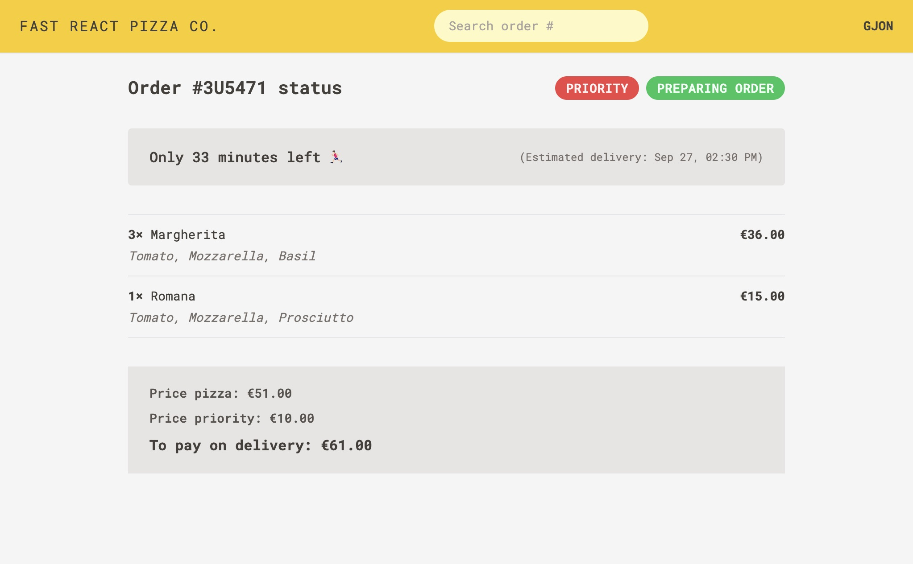

# Fast React Pizza Web App

A simple web app that allows users to place new pizza orders to their home. Built to highlight `Redux Toolkit` as well as modern routing with `RouterProvider`.

Project based on [The Ultimate React Course 2023](https://www.udemy.com/course/the-ultimate-react-course/) by Jonas Schmedtmann.

## Getting started

Run `npm install` or `bun install` to install all the required dependencies. All the backend logic is handled externally and provided by [their API](https://react-fast-pizza-api.onrender.com/api/menu).

```bash
$ npm install
$ npm run dev
```

## Screenshots

Home page


<br><br>

Menu page


<br><br>

Cart page


<br><br>

Place order page


<br><br>

Order overview page


